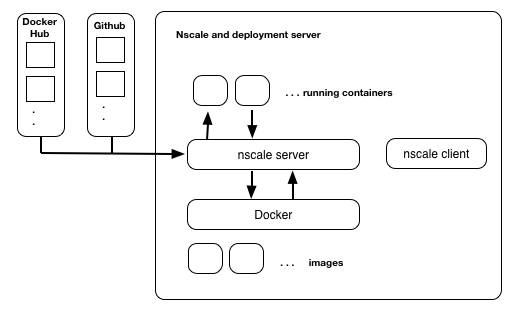
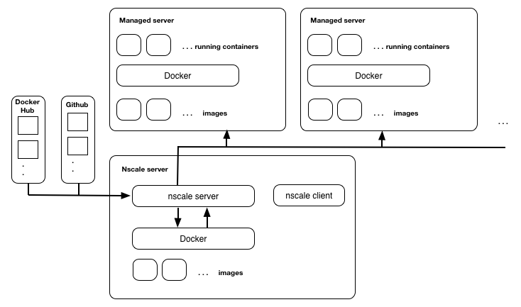

[](https://gitter.im/nearform/nscale?utm_source=badge&utm_medium=badge&utm_campaign=pr-badge&utm_content=badge)

> A toolkit for application deployment and container management

__nscale__ is an open toolkit supporting configuration, build and deployment of connected container sets. nscale is ideally used to support the development and operation of __microservice__ based systems.

Unlike other distributed container management systems, nscale aims to do the __simplest thing that could possibly work__. nscale aims to be simple to setup, configure and operate.

Full documentation including setup guides and tutorials are available 
[here](https://github.com/nearform/nscale-docs).

__nscale__ depends on [nodejs](http://nodejs.org/), [npm](http://npmjs.org/), [git](http://git-scm.com/) and [docker](http://docker.io).

## Overview
Typically an nscale deployment consists of a management server running nscale and a number of managed systems. Each of the managed systems requires a docker runtime only. nscale helps you perform the following tasks:

- Build and manage containers
- Define system infrastructure
- Track system changes over time
- Track deployment history
- Perform immutable deployments
- Perform fast safe rollback to known good state
- Perform homeostatic monitoring and updates
- Perform alogrithmic deployments

nscale can run in a local development configuration on a single system or as a management system for multipe target servers.

### Development configuration


In a development configuration, the nscale server and running containers live on the same system. This is a great way to get started with nscale or to use it for local development and testing.

### Production configuration


In a prodction configuration, the nscale server is installed on a managment instance and is configured to manage and control a set of controlled server instances. This configuration is commonly used on top of cloud infrastructure or on premesis servers.

## Quickstart
These quickstart instructions will get you up and running with nscale in a local development configuration. For more advanced use cases including production configrations on top of AWS please see the documentation.

### Install docker

#### Mac
If you are on Mac OS X, you need to install and run [boot2docker](https://github.com/boot2docker/boot2docker). Once you have installed boot2docker start it using:

```sh
boot2docker up
```

__IMPORTANT!!!! - Follow the instructions given by boot2docker and ensure that the correct environement variables are set!__

#### Linux
If you are on Linux, you will need to install [docker](http://docker.io). Once you have docker installed and running you will need to add your user account to the docker group. To do this run the following:

```sh
sudo usermod -G docker -a `whoami`
```

You may need to log out and log back in again for this change to take effect. To confirm that you have the appropriate permissions run:

```sh
groups
```

You should see that your user is included in the docker group. If this is not apparent you may need to close your current termial session and login again.

__IMPORTANT!!!! nscale will not function correctly unless the group permissions are set as above__

#### Other Platforms
We understand that there exist other operating systems, however at this time we do not support nscale on them. If you are feeling brave by all means give it a try, we always appreciate __pull requests!!__

### Install node

nscale is built using node.js. To install node, go to the [download page](http://www.nodejs.org) and install the appropritae binary for your system.

### Install git
nscale uses git as a backing store for system configuration and versioning. git can be installed using the package manager on your system of choice (i.e. homebrew on osx, apt-get on ubuntu...)

### Configure github access
Once git is installed, it should be configured for use with github if you wish to follow along with the nscale tutorials. You should run the following to set you username and email address:

```sh
git config --global user.name "<user name>"
```

```sh
git config --global user.email "<email>"
```

You will need to configure ssh access to github. See [this guide](asdf) to get ssh keys setup.

### Install nscale
nscale can be installed using npm. To install the latest version run:

```sh
[sudo] npm install -g nscale
```

### Preflight check
Before running nscale please ensure that the termial you are running in is correctly configured with the above pre-requisties.

#### github
Ensure github is correctly configured by checking the output of the following command

```sh
ssh -T -o "VerifyHostKeyDNS yes" git@github.com
```

#### docker
Ensure that docker can run correctly by executing the following command

```sh
docker ps
```

Note that this command should run __WITHOUT NEEDING SUDO__.

__IMPORTANT!!! If the above checks do not run cleanly, please go back and check your configuration. Don't even think about starting nscale until this is corrected. Seriously... we mean it - you'll make us very sad otherwise :(__

### Running nscale
Now that everything is configured you are good to start nscale:

```sh
nscale server start
```

Will kick off the nscale deamon. We now need to tell nscale about our git configuration. To do this run:

```sh
nscale login
```

### Run a demo application
You should now be able to clone the nscale demo application. To do this cd into a new empty working directory and run the following command:

```sh
nscale system clone git@github.com:nearform/nscaledemo.git
```

You can validate that the clone went OK by running

```sh
nscale system list
```

Which should show you the system configuration that you have just cloned.


### Build web container

```sh
nscale container build nscaledemo web
```

### Deploy nscale demo


Deploy the latest revision:

```sh
nscale revision deploy nscaledemo latest
```

or deploy any revision, by replacing \<revision_id\>
with the a revision shown by the revision list command.

```sh
nscale revision list nscaledemo
nscale revision deploy nscaledemo <revision_id>
```

### Open nscale demo in the browser

Get the boot2docker ipaddress from a terminal type:
  boot2docker ip

```sh
open http://<ipaddress>:8000
```

### Open web gui

```sh
open http://localhost:9000
```

### Logs

```sh
nsd server logs
nsd server logs api.log
nsd server logs web.log
```

### Help

```sh
nsd help
```

## License

Copyright (c) 2014 Nearform and other contributors

Licensed under the Artistic License 2.0
